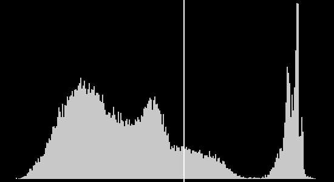

Otsu
=====

Otsu thresholding in C++

<a href="https://en.wikipedia.org/wiki/Otsu's_method">https://en.wikipedia.org/wiki/Otsu's_method</a>
 
<a href="http://www.labbookpages.co.uk/software/imgProc/otsuThreshold.html">http://www.labbookpages.co.uk/software/imgProc/otsuThreshold.html</a>

 

(C)Bruno Keymolen, bruno.keymolen@gmail.com
